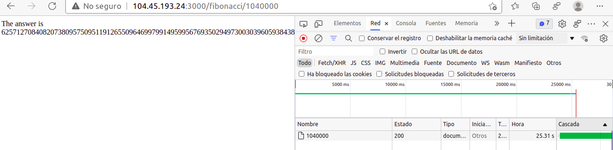
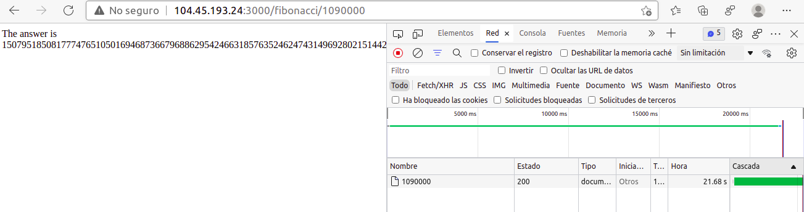
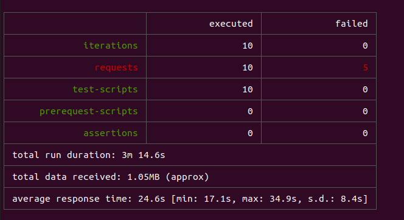
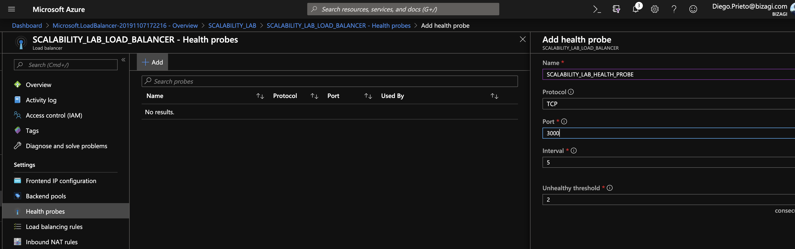
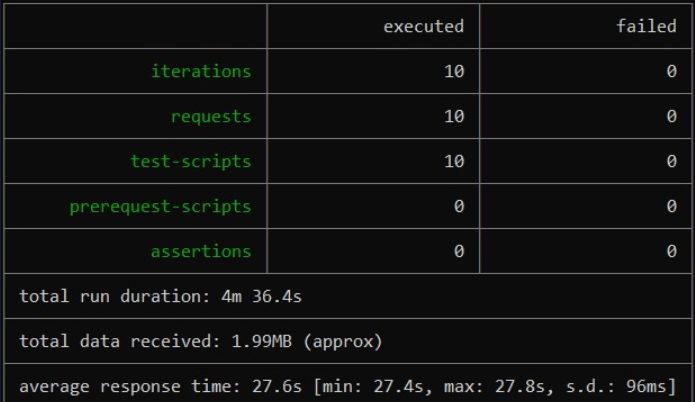

### Escuela Colombiana de Ingeniería
### Arquitecturas de Software - ARSW

## Escalamiento en Azure con Maquinas Virtuales, Sacale Sets y Service Plans

### Dependencias
* Cree una cuenta gratuita dentro de Azure. Para hacerlo puede guiarse de esta [documentación](https://azure.microsoft.com/en-us/free/search/?&ef_id=Cj0KCQiA2ITuBRDkARIsAMK9Q7MuvuTqIfK15LWfaM7bLL_QsBbC5XhJJezUbcfx-qAnfPjH568chTMaAkAsEALw_wcB:G:s&OCID=AID2000068_SEM_alOkB9ZE&MarinID=alOkB9ZE_368060503322_%2Bazure_b_c__79187603991_kwd-23159435208&lnkd=Google_Azure_Brand&dclid=CjgKEAiA2ITuBRDchty8lqPlzS4SJAC3x4k1mAxU7XNhWdOSESfffUnMNjLWcAIuikQnj3C4U8xRG_D_BwE). Al hacerlo usted contará con $200 USD para gastar durante 1 mes.

### Parte 0 - Entendiendo el escenario de calidad

Adjunto a este laboratorio usted podrá encontrar una aplicación totalmente desarrollada que tiene como objetivo calcular el enésimo valor de la secuencia de Fibonnaci.

**Escalabilidad**
Cuando un conjunto de usuarios consulta un enésimo número (superior a 1000000) de la secuencia de Fibonacci de forma concurrente y el sistema se encuentra bajo condiciones normales de operación, todas las peticiones deben ser respondidas y el consumo de CPU del sistema no puede superar el 70%.

### Parte 1 - Escalabilidad vertical

1. Diríjase a el [Portal de Azure](https://portal.azure.com/) y a continuación cree una maquina virtual con las características básicas descritas en la imágen 1 y que corresponden a las siguientes:
    * Resource Group = SCALABILITY_LAB
    * Virtual machine name = VERTICAL-SCALABILITY
    * Image = Ubuntu Server 
    * Size = Standard B1ls
    * Username = scalability_lab
    * SSH publi key = Su llave ssh publica


Nos dirigimos al apartado y creamos la maquina virtual


2. Para conectarse a la VM use el siguiente comando, donde las `x` las debe remplazar por la IP de su propia VM.

    `ssh scalability_lab@xxx.xxx.xxx.xxx`


3. Instale node, para ello siga la sección *Installing Node.js and npm using NVM* que encontrará en este [enlace](https://linuxize.com/post/how-to-install-node-js-on-ubuntu-18.04/).
4. Para instalar la aplicación adjunta al Laboratorio, suba la carpeta `FibonacciApp` a un repositorio al cual tenga acceso y ejecute estos comandos dentro de la VM:

    `git clone <your_repo>`

    `cd <your_repo>/FibonacciApp`

    `npm install`

5. Para ejecutar la aplicación puede usar el comando `npm FibinacciApp.js`, sin embargo una vez pierda la conexión ssh la aplicación dejará de funcionar. Para evitar ese compartamiento usaremos *forever*. Ejecute los siguientes comando dentro de la VM.

    `npm install forever -g`

    `forever start FibinacciApp.js`


6. Antes de verificar si el endpoint funciona, en Azure vaya a la sección de *Networking* y cree una *Inbound port rule* tal como se muestra en la imágen. Para verificar que la aplicación funciona, use un browser y user el endpoint `http://xxx.xxx.xxx.xxx:3000/fibonacci/6`. La respuesta debe ser `The answer is 8`.


7. La función que calcula en enésimo número de la secuencia de Fibonacci está muy mal construido y consume bastante CPU para obtener la respuesta. Usando la consola del Browser documente los tiempos de respuesta para dicho endpoint usando los siguintes valores:
    * 1000000
   
    * 1010000
   
   
    * 1020000
   
   
    * 1030000
    * 1040000
    * 1050000
    * 1060000
    * 1070000
    * 1080000
    * 1090000    

8. Dírijase ahora a Azure y verifique el consumo de CPU para la VM. (Los resultados pueden tardar 5 minutos en aparecer).


9. Ahora usaremos Postman para simular una carga concurrente a nuestro sistema. Siga estos pasos.
    * Instale newman con el comando `npm install newman -g`. Para conocer más de Newman consulte el siguiente [enlace](https://learning.getpostman.com/docs/postman/collection-runs/command-line-integration-with-newman/).
    * Diríjase hasta la ruta `FibonacciApp/postman` en una maquina diferente a la VM.
      
    * Para el archivo `[ARSW_LOAD-BALANCING_AZURE].postman_environment.json` cambie el valor del parámetro `VM1` para que coincida con la IP de su VM.
    * Ejecute el siguiente comando.

    ```
    newman run ARSW_LOAD-BALANCING_AZURE.postman_collection.json -e [ARSW_LOAD-BALANCING_AZURE].postman_environment.json -n 10 &
    newman run ARSW_LOAD-BALANCING_AZURE.postman_collection.json -e [ARSW_LOAD-BALANCING_AZURE].postman_environment.json -n 10
    ```
   
10. La cantidad de CPU consumida es bastante grande y un conjunto considerable de peticiones concurrentes pueden hacer fallar nuestro servicio. Para solucionarlo usaremos una estrategia de Escalamiento Vertical. En Azure diríjase a la sección *size* y a continuación seleccione el tamaño `B2ms`.


11. Una vez el cambio se vea reflejado, repita el paso 7, 8 y 9.

    1. Pruebas:
* 1000000

* 1010000

* 1020000

* 1030000

* 1040000

* 1050000

* 1060000

* 1070000

* 1080000

* 1090000


   2. Resultados de las pruebas:


   3.Resultados de ejecucion comando en postman


   4.Estadisticas en Azure de los resultados obtenidos con postman


12. Evalue el escenario de calidad asociado al requerimiento no funcional de escalabilidad y concluya si usando este modelo de escalabilidad logramos cumplirlo.
13. Vuelva a dejar la VM en el tamaño inicial para evitar cobros adicionales.

**Preguntas**

1. 쮺uántos y cuáles recursos crea Azure junto con la VM? 
   1. Disco virtual 
   2. Clave SSH 
   3. Interfaz de red 
   4. Grupo de seguridad de red 
   5. Direccion IP publica 
   6. Red virtual 
   7. Network watcher
   
2. 쮹revemente describa para qué sirve cada recurso?
   1. Disco virtual: Se ultiliza para el almacenamiento de datos 
   2. Clave SSH: Es la clave de conexión para el acceso remoto al servicio 
   3. Interfaz de red: Sirve para señalar la conexión que se da de manera física, entre los dispositivos y el sistema 
   4. Grupo de seguridad de red: Se utiliza para filtrar el tráfico de la red 
   5. Dirección IP pública: Permite acceder a la vm y a conexiones 
   6. Red virtual: Es la red vlan que se crea para darle conexión a la maquina virtual 
   7. Network watcher: Es un observador el cual administra el trafico externo de la red
3. 쮸l cerrar la conexión ssh con la VM, por qué se cae la aplicación que ejecutamos con el comando `npm FibonacciApp.js`? 쯇or qué debemos crear un *Inbound port rule* antes de acceder al servicio?
   1. La regla sirve para que  se indique  el servicio que se estará usando , en este caso se uso el puerto 3000.
   
4. Adjunte tabla de tiempos e interprete por qué la función tarda tando tiempo.
   1. Tabla de tiempos
      1. 
   2. Grafico
      1. 
5. Adjunte imágen del consumo de CPU de la VM e interprete por qué la función consume esa cantidad de CPU.
   1. 
6. Adjunte la imagen del resumen de la ejecución de Postman. Interprete:
    * Tiempos de ejecución de cada petición.
    * Si hubo fallos documentelos y explique.
   
   Estos fallos se deben a que al utilizar tantos recursos de la VM esta no tenia como responder a la solicitud realizada con postman generando así 4 fallos para las ejecuciones planeadas.
   
7. 쮺uál es la diferencia entre los tamaños `B2ms` y `B1ls` (no solo busque especificaciones de infraestructura)?
   1. La diferencia radica en que B2ms tiene 2 vCPUs, 8 GB de RAM, 1 data disk y cuesta $ 60.74 dólares mes mientras que B1ls tiene 1 vCPUs, 0.5 GB de RAM, 1 data disk y cuesta $ 3.80 dólares mensuales.
8. 쮸umentar el tamaño de la VM es una buena solución en este escenario?, 쯈ué pasa con la FibonacciApp cuando cambiamos el tamaño de la VM?
   1. No del todo, ya que si bien ayuda a bajar los tiempos de ejecución , estos tiempos se ven afectados por la mala optimización del código. 
9. 쯈ué pasa con la infraestructura cuando cambia el tamaño de la VM? 쯈ué efectos negativos implica?
   1. Implicaria a que se tenga que recurrir a posibles sobrecostos , si no se hace una buena eleccion de la maquina y los recursos que netamente se vayan a usar.
10. 쮿ubo mejora en el consumo de CPU o en los tiempos de respuesta? Si/No 쯇or qué?
    1. Si, Se evidenció una constante mejora ya que la maquina tuvo mejores recursos para dar una respuesta adecuada a las solicitudes hechasd desd eel postman.
11. Aumente la cantidad de ejecuciones paralelas del comando de postman a `4`. 쮼l comportamiento del sistema es porcentualmente mejor?
    1. mejora ya que la tasa de fallo se reduce entre más procedimientos se realizan. 
### Parte 2 - Escalabilidad horizontal

#### Crear el Balanceador de Carga

Antes de continuar puede eliminar el grupo de recursos anterior para evitar gastos adicionales y realizar la actividad en un grupo de recursos totalmente limpio.

1. El Balanceador de Carga es un recurso fundamental para habilitar la escalabilidad horizontal de nuestro sistema, por eso en este paso cree un balanceador de carga dentro de Azure tal cual como se muestra en la imágen adjunta.


2. A continuación cree un *Backend Pool*, guiese con la siguiente imágen.


3. A continuación cree un *Health Probe*, guiese con la siguiente imágen.




4. A continuación cree un *Load Balancing Rule*, guiese con la siguiente imágen.


5. Cree una *Virtual Network* dentro del grupo de recursos, guiese con la siguiente imágen.


#### Crear las maquinas virtuales (Nodos)

Ahora vamos a crear 3 VMs (VM1, VM2 y VM3) con direcciones IP públicas standar en 3 diferentes zonas de disponibilidad. Después las agregaremos al balanceador de carga.

1. En la configuración básica de la VM guíese por la siguiente imágen. Es importante que se fije en la "Avaiability Zone", donde la VM1 será 1, la VM2 será 2 y la VM3 será 3.


2. En la configuración de networking, verifique que se ha seleccionado la *Virtual Network*  y la *Subnet* creadas anteriormente. Adicionalmente asigne una IP pública y no olvide habilitar la redundancia de zona.


3. Para el Network Security Group seleccione "avanzado" y realice la siguiente configuración. No olvide crear un *Inbound Rule*, en el cual habilite el tráfico por el puerto 3000. Cuando cree la VM2 y la VM3, no necesita volver a crear el *Network Security Group*, sino que puede seleccionar el anteriormente creado.


4. Ahora asignaremos esta VM a nuestro balanceador de carga, para ello siga la configuración de la siguiente imágen.


5. Finalmente debemos instalar la aplicación de Fibonacci en la VM. para ello puede ejecutar el conjunto de los siguientes comandos, cambiando el nombre de la VM por el correcto

```
git clone https://github.com/daprieto1/ARSW_LOAD-BALANCING_AZURE.git

curl -o- https://raw.githubusercontent.com/creationix/nvm/v0.34.0/install.sh | bash
source /home/vm1/.bashrc
nvm install node

cd ARSW_LOAD-BALANCING_AZURE/FibonacciApp
npm install

npm install forever -g
forever start FibonacciApp.js
```

Realice este proceso para las 3 VMs, por ahora lo haremos a mano una por una, sin embargo es importante que usted sepa que existen herramientas para aumatizar este proceso, entre ellas encontramos Azure Resource Manager, OsDisk Images, Terraform con Vagrant y Paker, Puppet, Ansible entre otras.

#### Probar el resultado final de nuestra infraestructura

1. Porsupuesto el endpoint de acceso a nuestro sistema será la IP pública del balanceador de carga, primero verifiquemos que los servicios básicos están funcionando, consuma los siguientes recursos:

```
http://52.155.223.248/
http://52.155.223.248/fibonacci/1
```


2. Realice las pruebas de carga con `newman` que se realizaron en la parte 1 y haga un informe comparativo donde contraste: tiempos de respuesta, cantidad de peticiones respondidas con éxito, costos de las 2 infraestrucruras, es decir, la que desarrollamos con balanceo de carga horizontal y la que se hizo con una maquina virtual escalada.

3. Agregue una 4 maquina virtual y realice las pruebas de newman, pero esta vez no lance 2 peticiones en paralelo, sino que incrementelo a 4. Haga un informe donde presente el comportamiento de la CPU de las 4 VM y explique porque la tasa de éxito de las peticiones aumento con este estilo de escalabilidad.

```
newman run ARSW_LOAD-BALANCING_AZURE.postman_collection.json -e [ARSW_LOAD-BALANCING_AZURE].postman_environment.json -n 10 &
newman run ARSW_LOAD-BALANCING_AZURE.postman_collection.json -e [ARSW_LOAD-BALANCING_AZURE].postman_environment.json -n 10 &
newman run ARSW_LOAD-BALANCING_AZURE.postman_collection.json -e [ARSW_LOAD-BALANCING_AZURE].postman_environment.json -n 10 &
newman run ARSW_LOAD-BALANCING_AZURE.postman_collection.json -e [ARSW_LOAD-BALANCING_AZURE].postman_environment.json -n 10
```

**Preguntas**

* 쮺uáles son los tipos de balanceadores de carga en Azure y en qué se diferencian?,
* *Publico*: Proporciona conexiones salientes para máquinas virtuales dentro de su misma red virtual, mediante la traducción de ip privadas a ip publicas.
   *Privadas*: Se utilizan para equilibrar el trafico dentro de la red virtual.
  * 쯈ué es SKU, qué tipos hay y en qué se diferencian?, 
  Azure Container Registry está disponible en varios niveles de servicio (también conocidos como SKU). SKU Significa Unidad de mantenimiento de existencias (Stock Keeping Unit), son un código único asignado a un servicio o producto dentro de azure y representan la posibilidad para comprar existencias.
*Básico*: Un punto de entrada con costos optimizados para que los desarrolladores aprendan sobre Azure Container Registry. Los registros básicos tienen las mismas capacidades programáticas que Standard y Premium.

*Estándar*: Los registros estándar ofrecen las mismas capacidades que los básicos, con un mayor rendimiento de imágenes y almacenamiento incluido. Los registros estándar deben satisfacer las necesidades de la mayoría de los escenarios de producción.

*Premium*: Los registros Premium proporcionan la mayor cantidad de almacenamiento incluido y operaciones simultáneas, lo que permite escenarios de gran volumen. Además de un mayor rendimiento de imágenes, Premium agrega características como la replicación geográfica para administrar un solo registro en múltiples regiones, confianza en el contenido para la firma de etiquetas de imagen, enlace privado con puntos finales privados para restringir el acceso al registro.
* 쯇or qué el balanceador de carga necesita una IP pública?
  Es necesario asociar una dirección IP pública con una instancia de Azure Load Balancer para que pueda ser accesible desde internet. Esta dirección IP pública actúa como dirección IP de carga equilibrada.
* 쮺uál es el propósito del *Backend Pool*?
Define como evaluar los diferentes Back-Ends a través de sondas de estado, además de producir equilibrio de carga entre estos, en otras palabras, define el grupo de recursos que brindarán tráfico para una regla de equilibrio de carga determinada.
* 쮺uál es el propósito del *Health Probe*?
  Se deben realizar sondeos de estado para detectar el el endless point del Back-End, se determinan que instancias recibiran nuevos flujos, en otras palabras, determina si la instancia está en buen estado. Si la instancia falla su prueba de estado suficientes veces, dejará de recibir tráfico hasta que comience a pasar las pruebas de estado nuevamente.
  * 쮺uál es el propósito de la *Load Balancing Rule*? 쯈ué tipos de sesión persistente existen, por qué esto es importante y cómo puede afectar la escalabilidad del sistema?.
  Su objetivo es lograr conectar los IP de origen, Puertos de origen,IP de destino,Puerto de destino y administrar los Tipo de protocolo.
* 쯈ué es una *Virtual Network*? 쯈ué es una *Subnet*? 쯇ara qué sirven los *address space* y *address range*?
  Una Virtual Network o red virtual es una representación de la red propia en la nube, es un aislamiento lógico de la nube de Azure dedicada a su suscripción.
  Una Subnet permite segmentar la red virtual en una o más subnets y además asignarles una parte del espacio de direcciones de la red virtual de cada subnet, además se pueden implementar recursos que se han creado en Azure en una subnet específica.
  Los Address Space se deben especificar al crear una red virtual, debe ser un espacio de direcciones IP privadas personalizadas.
* 쯈ué son las *Availability Zone* y por qué seleccionamos 3 diferentes zonas?. 쯈ué significa que una IP sea *zone-redundant*?
  Es una oferta de alta disponibilidad que protege las aplicaciones y los datos de fallas que puedan ocurrir en el datacenter, las zonas de disponibilidad son ubicaciones físicas de una región determinada por Azure, cada zona cuenta con uno o varios centros de datos.
  Se dividen en 3 diferentes zonas para para proteger las aplicaciones y los datos de fallas del centro de datos, se ofrece un mejor SLA de tiempo de activiad de VM de 99.99%

Los servicios de zona redudante hacen que la plataforma se replique automáticamnete en todas las zonas.

* 쮺uál es el propósito del *Network Security Group*?
  Se puede filtrar el trafico de red hacia los recursos de Azure y desde los recursos de Azure en una red virtual de Azure con un grupo de seguridd de red, además contienen reglas de seguridad que permiten o niegan el táfico de una red entrante.
* Informe de newman 1 (Punto 2)
* Presente el Diagrama de Despliegue de la solución.
  Luego de realizar los pasos correspondientes para realizar las respectivas pruebas en Escalabilidad Vertical y Horizontal, se presenta primero la Escalabilidad Horizontal, en la que se evidencia que cada solicitud se demoró en promedio 27 segundos, donde ninguna solicitud falló.
  
Ahora, se presentan las pruebas luego de realizar Escalabilidad Vertical. Como se ve a continuación, cada solicitud se demoró en promedio 37 donde 4 solicitudes fallaron.


## Autores ✒️

* **Johan Damian Garrido**

* **Juaan Camilo Posso**

## Licencia 📄

Este proyecto está bajo la Licencia GNU General Public License mire el archivo [LICENSE.md](LICENSE.md) para detalles

